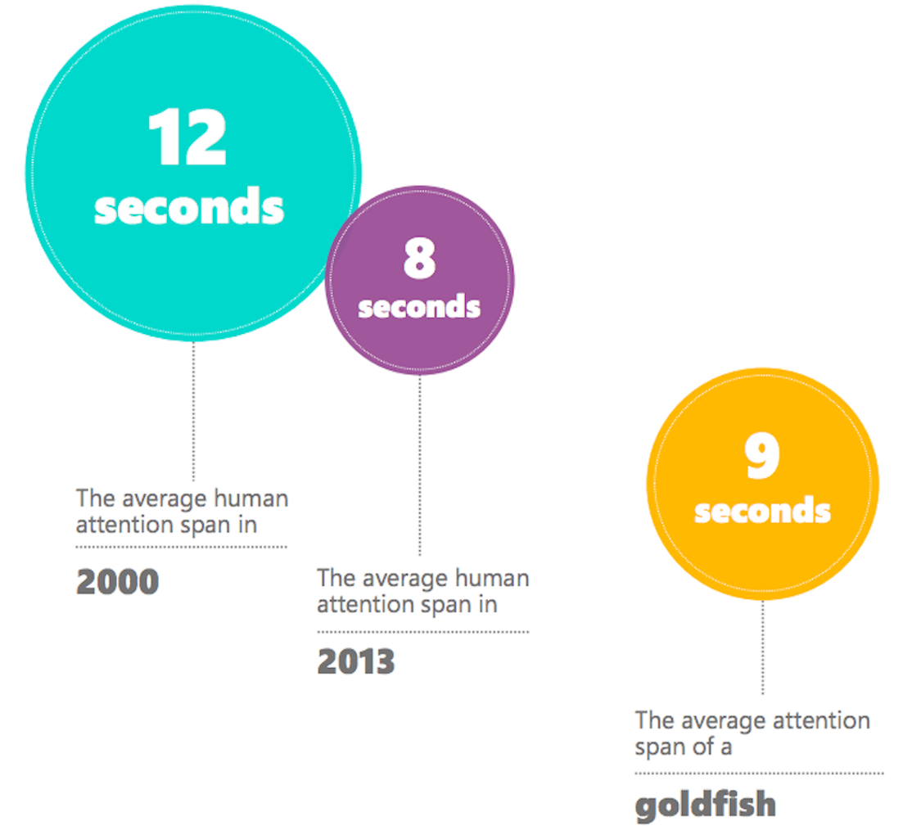

When you think of a good user story, you might imagine clear, succinct definitions of features that address real user needs and provide solid business value. They are the PO’s breakdown and representation of where the business needs to grow to keep customers happy and ensure future success.

While this is very meaningful from a business perspective, I find that writing user stories in this way ensures that they are _only_ meaningful to the business. The focus, terminology and scope is directed at a single audience - those that wrote the stories in the first place.

This often causes issues for members of the delivery team that don’t share that same mental model. Implementation details and blockers are not clear. Developers are fumbling over conflicting technical requirements and duplicated work. QA is never certain that the story is entirely finished, unsure that listed acceptance criteria cover all expected test cases. Ultimately, these issues make it impossible for the PO to accurately track progress.

> This is the kind of wasted velocity we want to **avoid**.

In order to overcome these issues and groom effective stories, changes will need to be made to the team’s grooming process. User stories should bring value to the entire team, unifying and guiding all those involved through the delivery process.

In the following sections, I’ll shed light on some of the more glaring issues I’ve experienced and offer a few suggestions on how to make grooming less painful.

## Write User Stories That People Will Actually Read

We live in a world of short attention spans and limited _focused_ mental bandwidth. Wether you believe the [click-bait posts](https://www.nytimes.com/2016/01/22/opinion/the-eight-second-attention-span.html?_r=3) perpetuated by news giants or prefer to remain [skeptical of the findings](http://www.bbc.com/news/health-38896790), the impact modern technology has had on the way we consume (and ignore) information is undeniable.

When discussing leadership, speaking, writing and really any activity that requires the attention of others, you’re often advised to grasp that attention as quickly as possible and hold onto it as long as you can. As a result, the content we create is formatted and organized in a way that caters to the impulsive needs of our target audiences.

Why don’t we apply these same principles to writing user stories?

When it comes down to it, our teams are full of regular people. We’re all busy, with mounting emails, endless meetings and constant Slack notifications. If our stories aren’t written in a consumable way, they simply won’t be consumed _at all_.

When you sit down to write your next user story, keep the following characteristics in mind.

* **Clear acceptance criteria** that outlines expectations and user needs. These should be comprehensible, succinct points that are narrow and focused on _individual_ requirements. This will ensure developers and QA can digest, implement and test every aspect of the story. In theory, someone should be able to walk off the street into your office, read a user story and get a descent sense of what is being asked.
* **Vertically sliced** segments of functionality that cut through all architectural layers of the application. Stories should add complete, functioning value to the product. To achieve this, a user story must capture all work required to be completed through the data, business and presentational layers of the application. Technical sub tasks can be broken out to tackle each layer separately, if sensible, but the story itself should capture the final state of a functioning feature.
* **Focused** on a single workflow or unit of value as part of a greater initiative. A user story shouldn’t cover too much ground, but just enough to deliver value. Bloated stories will come off as daunting and lead to avoidance, while slim stories will seem tedious and pointless, influencing the team to rush implementation and “move on to the next thing”. Striking that balance is key to maintain engagement while still delivering something meaningful.
* **Prioritized** [ruthlessly](https://blackboxofpm.com/ruthless-prioritization-e4256e3520a9). User stories should be constantly re-prioritized and re-ordered in a way that represents current needs, adjusting for ROI, effort required and blocking dependencies accordingly.

Remember, we’re all regular people at the end of the day. Through the myriad of distractions and depletion of focus we endure, let’s put some effort into making our delivery process as painless as possible.

Don’t rely on willpower alone to prevail. Reduce the friction and get your team focused in a unified direction.

## Include The Whole Team

Traditionally, stories are written by someone with a mental model of where the product needs to grow. They proceed to formalize these thoughts and break them up in a way that makes sense to them and the business. Finally, the result of this exercise is shared with the rest of the team for implementation.

The entire delivery team is responsible for shipping value to your customers. Every member of the team will have difference needs and styles of work that have to be taken into consideration. To be truly agile, every member of the team needs to function as an inter-disciplinary cohesion of diverse talents. As such, members of these diverse roles should not be expected to bend to the style of writing, organization and planning that’s optimized for the business. The chance of this shared context translating well across roles are slim.

While grooming, take your team’s dynamics into consideration. **Include every role in the process**.

Through shared understanding, you reduce the risk of miscommunication and divergence during delivery. Every role on your delivery team has different skills and needs. By defining work in a diverse way that speaks to all talents, you can unlock your team’s full potential and reach peak velocity.

## Separate Concerns Between Task Categories

Project management software, like JIRA or Asana, provide you with the tools you need to successfully guide and track your software project from start to finish. These tools are considered standard practice for modern software initiatives.

The breadth of features provided by these tools equip your team with great flexibility through configuration, but with that comes the potential for complexity. Your team could end up drowning in countless workflows, views and reports, ultimately causing the very issues these tools set out to solve.

Clean coding teaches us separation of concerns between classes and modules through what is called the _Single Responsibility Principle_. As originally described by Robert C. Martin in [Agile Software Development, Principles, Patterns, and Practices](https://www.amazon.com/Software-Development-Principles-Patterns-Practices/dp/0135974445), a class should only have **one reason to change**. This segmentation ensures that a collection of logic is encapsulated and focused on a single purpose.

This same philosophy should be applied to the tasks we create in our project management software. Too often, information is duplicated across epics, stories, sub-tasks, defects, etc. This confuses anyone who tries to pick up the pieces through the delivery process. Developers are scrambling between tickets to ensure they capture all requirements, often bothering the PO if clarity isn’t achieved. QA doesn’t know where to look to find the “true” acceptance criteria that needs to be tested. POs have to remember to update every ticket affected by a change in requirements, falling prey to human error.

These tools and processes are in place to help us achieve velocity. If instead they’re crippling our progress, **something is broken**.

From my experience, I’ve had good results sticking to the following classifications and separations of concerns between ticket categories.

* **Epics** should be written by the PO to capture entire initiatives. These are high level tasks that are written in an executive level language that speaks to business owners. Epics should state clear goals that the team can rally behind and stay focused.
* **Stories** should be written by the PO, breaking epics down into sizeable chunks of functionality. I already went into user story writing in the previous section, but I want to re-iterate how critical it is that stories stay relevant to the business. This is the PO’s value-centric breakdown of a larger initiative that can be used to track the overall progress of the delivery of said initiative.
* **Sub-Tasks** should be written by developers to outline the technical implementation details for a given story. These tasks are for developers only to be completed during the sprint. A single story could have one matching task, many tasks or share tasks between other stories. The goal is to create tasks that logically break down the work required of developers, across stories, to be utilized in a way that’s most efficient for them to deliver. Once all tasks linked to a story are completed, it should be ready for test.
* **Defects** should be written by QA to capture errors or missed criteria in stories. Defects should be described in detail, with clear steps to reproduce and screenshots or videos If possible. Stories should be linked so that missed acceptance criteria is clear.

The distinctions defined above should be clear and their language consistent. Product should be able to define what they need in a language they understand. Development and QA should be no different. With this clean separation, each member of the team can work as efficiently and comfortably as possible.

## Groom User Stories Your Delivery Team Will Love

These days, high quality software doesn’t get delivered by a single person. There are groups of talented and diverse individuals in different fields of practice with varying disciplines and perspectives. To truly get the most out of your delivery team, the stories that ultimately drive the product’s development should be groomed in a way that compliments these dynamics.

* **Readability** is critical in ensuring that your stories get consumed efficiently, with minimal errors and confusion. Remember, anyone should be able to walk off the street, read a story and grasp the ask.
* **Inclusion** among varying disciplines in the team before and during grooming could proactively prevent lost time and churn during implementation.
* **Separation of concerns** between task categories improves clarity as to where information can be found and reduces duplication across tasks.

> Grooming doesn’t have to be painful.

We take pride in the work that we do and strive to ship successful products. There should be a willingness in us all to pivot and adjust process to reach that shared goal. Well crafted user stories should unify the team’s joint vision and ultimately drive the product to success.

Groom user stories that empower your team and they will deliver.
