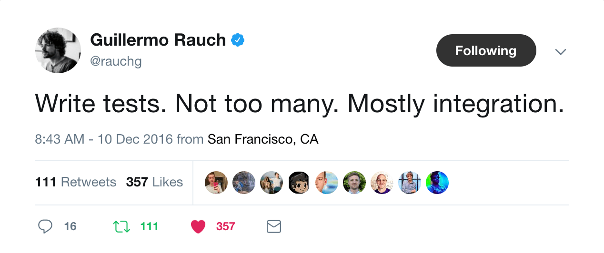

I think we can all agree that testing code is valuable.

Well tested code assures the completion of acceptance criteria, guiding implementation by outlined requirements. It empowers you to extend and refactor with a sense of safety, knowing that existing functionality won’t break as a result of your changes. Over time, your team gains increasing returns as the growing number of tests reduce the likelihood of surprising, hard-to-diagnose bugs appearing and derailing production software, often coming at a cost of significantly more time than it took to write the tests in the first place. Not to mention, this increased quality lowers the chance of production bugs being exposed to your customers, potentially driving them away from your product as a result. These tests even act as a form of living documentation for your code, clearly describing intent…

The list goes on.

Ultimately, testing leads to increased software quality, reliability and customer retention, while at the same time reducing overall cost. Most developers are well aware of these benefits. Yet, many of the production software we write is severely under-tested.

Why do we seem to resist following a practice that is ultimately designed for the collective benefit of _all_ stakeholders?

I believe it comes down to **culture**. A shared mindset across organizations to turn a blind eye to the undisputed value that well tested software brings. Perhaps it was pressure from management, instilled in the company from early contributors or developed slowly over time due to overall lack of diligence. No matter what the cause(s) may be, it’s ingrained in your company’s culture now and you’re stuck. This quote from Tom DeMarco and Tim Lister’s [Peopleware](https://www.amazon.ca/Peopleware-Productive-Projects-Teams-3rd/dp/0321934113) captures the issue perfectly:

> “People hate change…\
> and that’s because people hate change…\
> I want to be sure that you get my point.\
> People really hate change.\
> They really, really do.”\
> – Steve McMenamin, The Atlantic Systems Guild, 1996

People don’t like being pushed out of their comfort zones. Even if a change is clearly positive, it is in our nature to resist any irregularity that challenges our norm. It’s easy to sit back and coast along, but if you want to reap the benefits outlined above for your team, organization and ultimately the customer, change will have to be faced.

> Breaking culture is hard, but it’s not impossible.

In the rest of this post, I’m going to dive into what I call **habitual testing**. A collection of techniques and patterns I’ve adopted across the organizations I’ve worked at that have helped slowly build testing awareness and intuition. This process aims to instil small bits of change over time, while gradually forming good testing practices as the team adjusts and observes the benefits.

## Think Before You Test
I came across this tweet a while back from [Guillermo Rauch](https://twitter.com/rauchg)‏ that really spoke to me:

In only a few words, he was able to sum up much of my own philosophy of how to approach testing. Especially in teams that don’t support testing as a core part of their development process.

> We only have so much time to test, so test _smart_.

Some teams get turned off of testing large legacy projects due to the sheer amount of code that needs to be covered. Others might question the value of spending time writing thousands of lines of detailed test code to cover disproportionately less lines of production code.

I’m not advocating that you drop what you’re doing to test every line of code in your project. The point being conveyed here is that you should write tests that are **valuable**. 100% code coverage does not necessarily mean that your code is well tested. Not all code paths need to be unit tested with precision. Not all APIs need integration tests. Not every UI component/workflow needs end-to-end tests. It’s our responsibility as engineers to determine what tests will bring us the most return on the time invested in writing _and_ maintaining them.

An often shared model illustrating different forms of testing is what’s known as the **Test Pyramid**:

This diagram is often used to emphasize the importance of having a wide base of small, fast unit tests that cover the whole codebase, with some integration tests to “fill the gaps” and a few E2E tests to tie everything together. Alternatively, if we were to break down the diagram by _customer value_ (in terms of certainty in the product’s complete functionality) and _cost_ (effort expended to write), we would get the following:

* **Unit** = low value, low cost
* **Integration** = medium value, medium cost
* **E2E** = high value, high cost

The more surface area a test covers, the more expensive (ie. time consuming) it is to implement, but the most value that it brings. Larger tests are less _precise_ but more _accurate_ at validating correctness by user story acceptance criteria. To put it another way, your tiny units of work can function absolutely perfectly but provide no certainty that the API your customers hit will respond in a way that is acceptable.

If we were to re-draw this diagram in a way that better represents this new mental model, we might get something like the following (as shared by [Kent C. Dodds](https://twitter.com/kentcdodds)):

Here’s how this new diagram can be interpreted:

1. **Write mostly integration tests** to ensure the program is running correctly. Testing your units interacting with one another allows you to create scenarios that match real customer use cases. Does your payment API react as expected when an expired credit card is provided? Does your authentication layer correctly handle password resets? These could all be potential customer requirements that you’re able to validate directly, providing highly valuable assurances to your customers. Make sure you test optimal cases to confirm functionality and plenty of fail cases to ensure errors are being handled correctly.

2. **Write unit tests for complex components** with high variability and many split code paths. These are typically the oldest, most convoluted parts of your application. Unit testing these heavily will help alleviate the fear of “breaking things” when you are forced to modify them. Unit tests should be short and concise, acting as a form of detailed usage documentation.

3. **Write E2E tests for critical workflows** that don’t change frequently. The latter is critical, as these are often very time consuming and brittle tests to write. Any time your UI or API’s interface needs to be changed, these tests need to be updated. While they provide high value, as they test exact workflows, use them sparingly and only when most beneficial.

Apply these insights to your testing strategy to ensure you get the most return on your investment. Remember to take a step back before writing a test, reference the points above and ask yourself if your current approach is appropriate.

## Be a Good Boy Scout
Another deterring aspects of fully testing a completely untested codebase is the potential need for heavy refactoring to support sane testability. Most code written _without_ testing in mind is often untestable as a result (ie. giant functions, several dependencies, global state, etc). The older and larger the codebase is, the more daunting this task becomes. Combine this with an ever growing backlog of new feature work and looming deadlines and you’re left with a recipe for disaster.

I don’t blame you.

Tackling a large, untested codebase head first, much like jumping into an aggressive diet or workout routine, is simply too much to take on at once. The _goal_ of having a fully tested codebase doesn’t seem feasible. What you want to do is to foster a _habit_ of piecemeal testing, attacking the monolith one step at a time.

In her book [Succeed](https://www.amazon.ca/Succeed-How-Can-Reach-Goals/dp/0452297710), [Heidi Grant Halvorson](https://twitter.com/heidgrantphd) lays out a simple practice to overcome procrastination that she calls an **if-then plan**, in which we identify a scenario that we would like to respond to by completing a certain task.

> “Planning creates a link between the situation or cue (the _if_) and the behaviour that you should follow (the _then_).”

When the cue is encountered, the desired behaviour is triggered _automatically_. This is the key to the success of this plan, the sub-conscious response that we teach ourselves won’t tax our self-control and ensuring that the desired task gets completed.

By adhering to a few simple guidelines, you can teach yourself (and your team) the required if-then plans to leave every nook and cranny of your codebase with better coverage than when you first touched it, as if it were second nature.

1. **Test every new bug** - When a production bug is reported, your instinct is to immediately sift through logs and attempt to replicate the error locally before proceeding to tinker and develop a solution. Before committing that code, stop and write a test. Not only does this increase code coverage, but it guarantees that if this bug is ever re-introduced it will be caught by your test runner, not your customers. If there’s no test, it didn’t happen.

2. **Test every new feature** -  New code is easy to test. You have full control over how to encapsulate your logic, split and limit dependencies and ultimately make the feature as painless to test as possible. Challenge yourself to sensibly test any new code that you write until you’ve achieved a comfortable level of certainty in what you’re about to ship.
3. **Test before you refactor** - Refactoring runs the risk of introducing regressions by incorrectly re-implementing old code based on misinterpreted intentions. Before you refactor, write some tests to define how the code is functioning correctly today. This way, you can assert and rest assured that your refactored code is functioning exactly as intended.

Integrating these if-then plans into your development process introduces light testing sprinkled throughout your day-to-day tasks. Before you know it, you’ll be thinking about ways to test your code before you write it.

## Make it Simple
[Charles Duhigg](https://twitter.com/cduhigg) compares our willpower to a muscle in his book [The Power of Habit](http://charlesduhigg.com/books/the-power-of-habit/), suggesting that there is only so much willpower we can exert before we run out of steam. Over-exerting ourselves early during trivial tasks results in depleted self-control and lack of discipline when the time comes to apply ourselves for the work that really matters.

Our work lives are full of tasks that require willpower. Checking emails, keeping JIRA tickets up to date and responding to Slack notifications gradually deplete your willpower reserves throughout the day. Eventually, you can become so drained that you start to slip and lack diligence when it comes time to work on more meaningful tasks (like testing your code).

While you can take measures to reduce the negative impact and frequency of these menial tasks, the reality for most of us is that we’re not in a position to block them out entirely. What  we _are_ in a position to do is make sure that testing doesn’t get negatively affected by our drained reserves. By making testing as straightforward and painless as possible, we reduce the effort required to write them and in turn minimize the risk of writing rushed, careless tests when we hit our lowest point of determination.

1. **Write utility functions** to reduce duplication of commonly repeated tasks. This is common practice in feature, DRYing out repetition and code duplication. Make sure the same philosophy is applied to test code. Do you find yourself creating a new user, generating a login token and applying to to requests for all API integration tests? Are you always stubbing out Stripe APIs when you test anything payment related? Write a utility that takes care of that for you in one line. The more you extract, centralize and simplify the prep work, the more streamlined and approachable testing becomes.
2. **Leverage code snippets/generators** to bootstrap new tests quickly. As you write more and more tests you’ll establish certain patterns. Your tests will start looking the same. At this stage, taking some time to separate unique test code from the scaffolding will enable the use of code generators. These snippets can be mapped to key combinations in most modern editors and inserted at will, removing the need to hand write (or likely copy/paste) the same code from previous tests over and over again. This is the lowest form of yak shaving that really sucks the enjoyment out of writing software. These templates can act as boilerplates for new tests, removing the busy work and make writing tests feel like less of a chore.
3. **Create fixtures for your data models** that can be used to seed fresh test databases. There’s nothing more frustrating than having to mock and “stage” the right data for your tests, especially if an integration test touches several entities with their own dependencies. Detailed, randomized test fixtures with robust extensibility make data generation a breeze. They even provide the added benefit of painless seeding for local environments and one-off staging servers for demos.
4. **Make debugging easy** for everyone. No one likes debugging with print statements. While it’s standard these days to work in an engaging debugging environment for application development, don’t leave your test build hanging. Make sure the effort required to debug and step through test runs is minimal, preferably just as intuitive and supportive as your main application. The last thing you want is to have everyone on the team start skipping broken tests or re-running intermittently failing tests because the effort required to find and fix the root cause is too great.

With the right tools at your team’s disposal, testing can become less of a chore and at times even enjoyable. We go to great lengths to make our development environment as pleasant to work with as possible. It’s time to apply the same mindset to our test tooling.

## Have Rules
[Sandi Metz](https://twitter.com/sandimetz) gave a talk called [Rules](https://www.youtube.com/watch?v=npOGOmkxuio), which outlines 5 rules for writing object oriented code. Furthermore, she digs into how social scientists define rules and the impact they have on willingness and self-discipline. The results are illuminating, and the benefits can be applied across domains.

Ultimately, the rules you set are arbitrary and it’s perfectly okay to break them if reasonable. It’s the very _existence_ of these rules that bias towards co-operation and collaboration, towards maintaining the “state of things”. By setting hard rules that govern how testing should be done, you are effectively influencing followers to uphold standards and push non-followers towards adhering to your norms.

When you start thinking about the kinds of rules you want to set for your own team, keep the following two metrics in mind:

1. **Code Coverage** - Add code coverage analysis to your test suite and set some rules dictating how much coverage you intend to maintain. Integrate tooling into your version control provider of choice and automatically block pull requests that don’t meet your standards. Perhaps there are certain limits you want to set per metric or maybe you just want to ensure overall coverage doesn’t decrease. Once again, the rule itself isn’t entirely important. Code coverage metrics are not a silver bullet, but adding limitations will be a constant reminder to the team that testing is a key indicator of quality.
2. **Test Coverage** - Writing tests is a good thing, but writing the _right_ tests is where you get the biggest gains. Just because your code is covered doesn’t mean it is tested sufficiently. New or modified tests should be compared against requirements to ensure all identified use cases have been covered. While this manual process can be tedious at times, these spot-checks instil an understanding of the importance of asserting all required use cases. You may begin to notice that these spot-checks become mute, that use cases are always being covered and these manual checks are only slowing you down. That’s when you know the rules have done their job.

Rules can have a profound effect on your team, wether they realize it or not. The metrics detailed above may not be perfect, but they serve the purpose of nudging team members toward the norm of constant, habitual testing.

## Develop Habits That Work For You
Embracing effective software testing patterns can be a daunting, uncomfortable and downright painful experience. It doesn’t have to be. Take advantage of the mechanics hardwired in your brain. Create a framework that fosters the formation of habits that encourage a strong testing culture.

* **Think** before you write your tests. Make sure you’re getting the maximum return on your investment.
* **If-Then** plans trigger an automatic response to certain coding scenarios. Take advantage of them to elicit a positive response (via tests).
* **Tooling** that supports painless testing will ease the barrier of entry for writing future tests.
* **Rules** will have an impact on the willingness and self-discipline of your team when it comes to diligently testing their code.

The final takeaway to making habitual testing a success is _believing_ that it’s possible. Forming habits can be a challenge. It takes significant time and effort to realize the fruits of your labour, but the result is truly satisfying. To quote [Charles Duhigg](https://twitter.com/cduhigg) once again in [The Power of Habit](http://charlesduhigg.com/books/the-power-of-habit/):

> If you believe you can change – if you make it a habit – the change becomes real.

Develop positive testing habits that work for you. Don’t trust willpower alone to prevail. Leave conscious choice and debate out of the equation.

Make it automatic.
